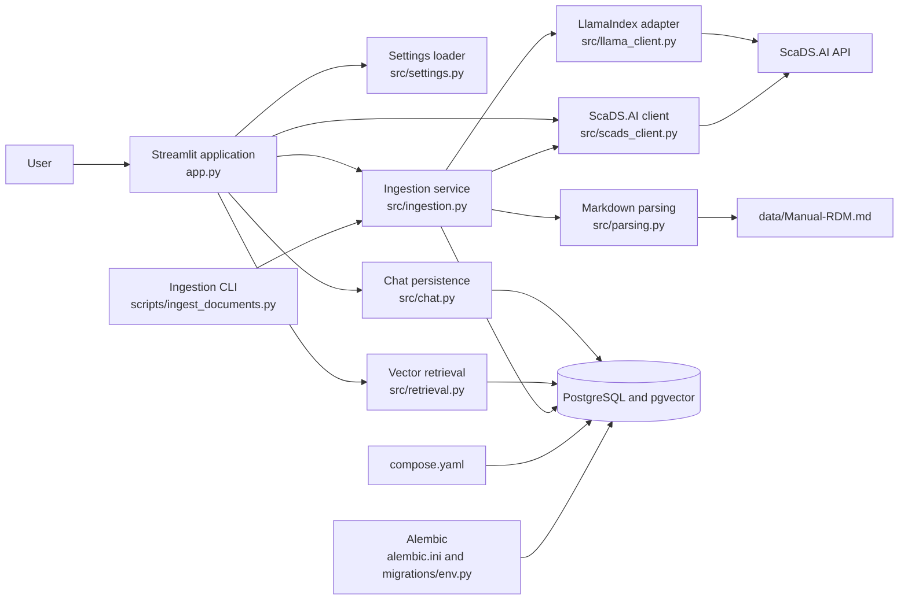
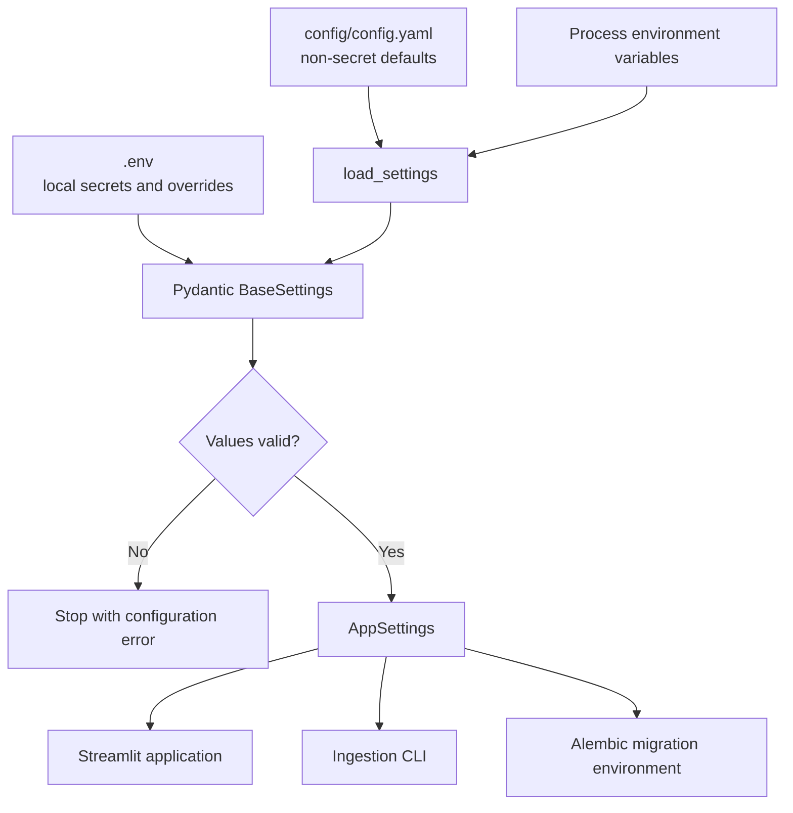
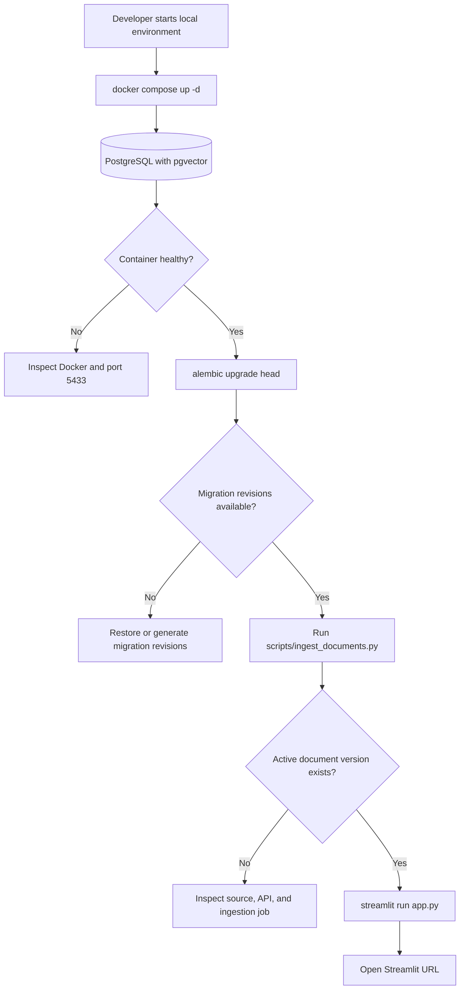
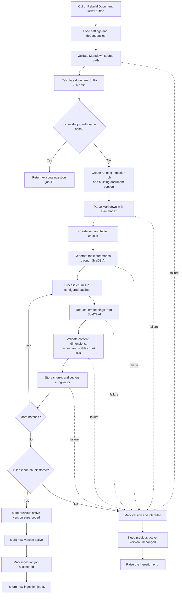
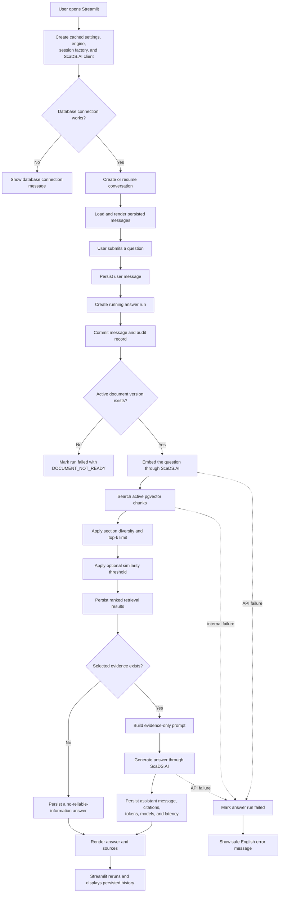
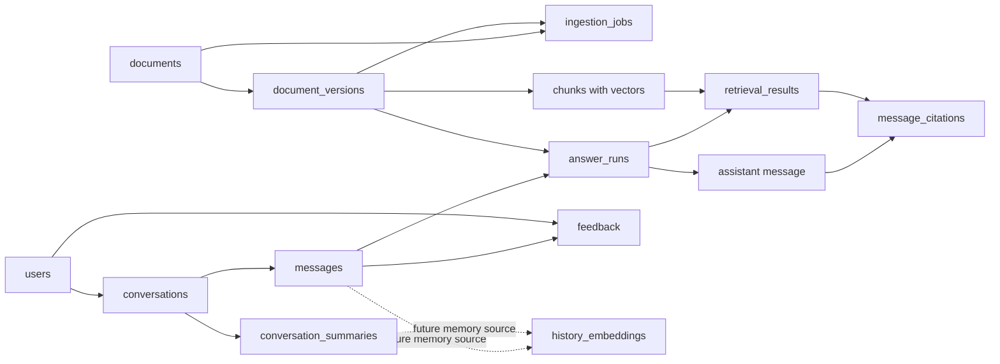
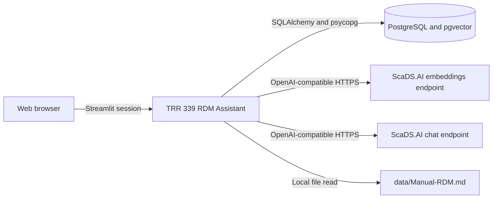

# TRR 339 RDM Assistant: File Guide and System Flow

## 1. Purpose

This document explains the responsibility of every project-owned file in the
current repository and shows how the application starts, indexes the RDM manual,
answers questions, and persists its results.

The application is a retrieval-augmented generation system with four main parts:

- A Streamlit user interface.
- A PostgreSQL database with the pgvector extension.
- A Markdown ingestion pipeline built with LlamaIndex.
- A ScaDS.AI OpenAI-compatible API for embeddings and answer generation.

## 2. System Overview

## 3. Repository File Guide

### 3.1 Root Files

| File | Responsibility |
| --- | --- |
| `.env` | Local runtime secrets and environment-specific values. It supplies the ScaDS.AI endpoint, API key, database URL, and optional port override. It must not be committed. |
| `.env.example` | Template showing the environment variables required by the application. Developers copy it to `.env` and provide real values. |
| `.gitignore` | Excludes secrets, local data, local configuration, documentation directories, caches, and generated Python artifacts from Git. |
| `README` | Primary setup and operating guide. It describes the project scope, database startup, schema migration, document ingestion, application startup, and verification commands. |
| `alembic.ini` | Alembic configuration. It points Alembic to `migrations/`, configures logging, and supplies a placeholder URL that `migrations/env.py` replaces at runtime. |
| `app.py` | Streamlit entry point and application orchestrator. It initializes settings and clients, creates conversations, handles questions, runs retrieval and generation, records results, renders citations, and exposes the document-index rebuild action. |
| `compose.yaml` | Defines the local `pgvector/pgvector:pg16` database container, credentials, persistent volume, health check, and host port mapping from `5433` to PostgreSQL port `5432`. |
| `environment.md` | Personal environment notes for creating a virtual environment and managing a Jupyter kernel. Some commands are historical and are not part of the application runtime. |
| `flowchart.md` | This file. It documents file responsibilities and end-to-end execution flows. |

### 3.2 Configuration and Source Data

| File | Responsibility |
| --- | --- |
| `config/config.yaml` | Non-secret application defaults, including model names, source path, chunk sizes, retrieval limits, timeouts, retry counts, and embedding batch size. Environment variables override matching values. |
| `data/Manual-RDM.md` | Canonical Markdown knowledge source indexed by the application. Its text, headings, and tables become searchable chunks. |

### 3.3 Command-Line Scripts

| File | Responsibility |
| --- | --- |
| `scripts/ingest_documents.py` | Thin command-line entry point for document ingestion. It parses `--source`, loads settings, creates database and LLM dependencies, invokes `ingest_document`, and prints the ingestion job ID. |

The script contains no indexing rules itself. The reusable implementation stays
in `src/ingestion.py`, allowing both the command line and Streamlit sidebar to
run the same ingestion process.

### 3.4 Application Modules

| File | Responsibility |
| --- | --- |
| `src/__init__.py` | Marks `src` as a Python package and identifies it as the TRR 339 RDM Assistant application package. |
| `src/settings.py` | Defines validated typed settings with Pydantic. It loads `.env`, reads YAML defaults, applies environment overrides, protects secret values, and validates numeric configuration. |
| `src/db.py` | Defines all SQLAlchemy enums, tables, constraints, relationships through foreign keys, pgvector column behavior, engine creation, session creation, and transaction helpers. |
| `src/errors.py` | Defines stable machine-readable error codes and transport-independent success or failure payloads. |
| `src/chat.py` | Implements transactional conversation persistence. It creates conversations, appends sequenced messages, starts answer runs, completes runs with citations and token metrics, and records failures. |
| `src/scads_client.py` | Wraps the ScaDS.AI OpenAI-compatible API. It requests embeddings and chat completions, validates response shapes, captures token usage, and converts external failures into stable application errors. |
| `src/llama_client.py` | Adapts the ScaDS.AI chat model to LlamaIndex. It supplies model metadata and enables structured output for Markdown table summarization. |
| `src/parsing.py` | Loads one Markdown file and parses it with LlamaIndex. It separates chapter structure, text chunks, and table elements using configured chunk size and overlap. |
| `src/ingestion.py` | Implements the versioned indexing workflow. It validates source paths, hashes documents, avoids duplicate ingestion, parses content, creates embeddings, validates chunks, stores them, and atomically activates a successful document version. |
| `src/retrieval.py` | Builds cosine-distance pgvector queries against the active document version, enforces section diversity, applies the optional similarity threshold, ranks results deterministically, and groups selected chunks into citations. |

### 3.5 Database Migration Files

| File | Responsibility |
| --- | --- |
| `migrations/env.py` | Connects Alembic to the application settings and SQLAlchemy metadata. It supports online and offline migration execution and enables type comparison. |

The current checkout has no file under `migrations/versions/` and no
`migrations/script.py.mako`. The database may continue to work if it was migrated
earlier, but a clean checkout cannot recreate or evolve the schema with Alembic
until the migration revision and template are restored or regenerated.

## 4. Configuration Flow

`src/settings.py` combines configuration from YAML and environment sources.
Secrets belong in `.env`; non-secret defaults belong in `config/config.yaml`.

Important precedence behavior:

1. `config/config.yaml` supplies base values.
2. Matching process environment variables are explicitly passed as overrides.
3. Pydantic also reads `.env` for values not already supplied.
4. Validation rejects invalid limits, overlaps, thresholds, and missing required
   connection values.

## 5. Local Startup Flow

The expected order is database, schema, document index, then application. The
Streamlit process can start before ingestion, but it will report that no active
document index is available when a user asks a question.

## 6. Document Ingestion Flow

Ingestion can start from either `scripts/ingest_documents.py` or the Streamlit
sidebar button. Both entry points call the same `ingest_document` function.

### Ingestion Guarantees

- Source files must be Markdown files inside the configured data root.
- A content hash makes successful ingestion idempotent.
- Chunk IDs are stable for the same document content and section position.
- Embedding dimensions must be consistent.
- Chunks are written in batches to limit request and transaction size.
- The new version becomes active only after all validation succeeds.
- A failed build does not replace the previous active version.

## 7. Question-Answer Flow

### Retrieval Rules

1. Only chunks from the active document version are eligible.
2. The query uses pgvector cosine distance through the `<=>` operator.
3. Candidate ordering uses distance first and stable chunk ID second.
4. The database initially returns a larger candidate pool when section diversity
   is enabled.
5. At most three chunks per section are retained by default.
6. The final result list is truncated to `retrieval_top_k`.
7. An optional similarity threshold controls which results enter the model
   context.
8. Citations are grouped by section path and retain deterministic display order.

## 8. Persistence Map

`src/db.py` defines the complete persistence model.

### Main Record Lifecycles

- `document_versions`: `building` to `active`, `superseded`, or `failed`.
- `ingestion_jobs`: `pending` or `running` to `succeeded` or `failed`.
- `answer_runs`: `running` to `succeeded` or `failed`.
- `messages`: immutable ordered user and assistant conversation entries.
- `retrieval_results`: ranked evidence candidates recorded for each answer run.
- `message_citations`: links displayed assistant answers to selected retrieval
  results.

## 9. External Boundaries

The application does not use the OpenAI public endpoint unless `SCADS_API_URL`
is explicitly configured that way. The ScaDS.AI base URL and key determine the
actual external service boundary.

